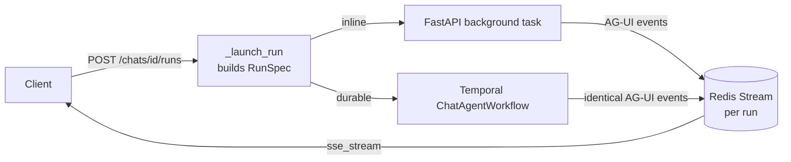

# Architecture

Personal Agent (Python package `personal_agent`) is a multi-tenant, self-hostable
**LLM chat + agent platform**. The stack is FastAPI + pydantic-ai (v1.x), Temporal
(self-hosted, durable agent runs), Quasar/Vue 3 frontend, Keycloak/OIDC,
Postgres+pgvector, Redis, Kubernetes/Compose.

## Services at a glance

| Service | Repo / path |
| --- | --- |
| **backend** | `personal-agent-org/backend`, `src/personal_agent/` (FastAPI server + pydantic-ai runtime; Temporal client; AG-UI over Redis Streams → SSE, WebSocket control). |
| **worker** | `personal-agent-org/backend`, `src/personal_agent/worker/` (Temporal worker subpackage: durable runs, the per-chat memory **Curator**, scheduled maintenance). |
| **frontend** | `personal-agent-org/frontend` (Quasar (Vue 3) SPA at the repo root). |
| **keycloak** | `personal-agent-org/deploy`, `keycloak/` (OIDC auth, realm-as-code). |
| **Postgres + pgvector** | Primary store + vector search. |
| **Redis** | AG-UI token stream, control/presence pub/sub, rate limits. |
| **Temporal** | Durable engine for runs, the Curator, and schedules. |
| **device-agent** | `personal-agent-org/device-agent` (cross-platform Rust agent, jailed FS + PTY). |
| **tui** | `personal-agent-org/tui` (Rust terminal client over the same HTTP/SSE API). |
| **browser-sandbox** | `personal-agent-org/browser-sandbox` (Playwright cloud browser `browser` device). The Chrome/Firefox extension (the other `browser` device) is a separate repo, `personal-agent-org/browser-extension`. |

Shared **contracts** (identity, run spec, bus record, AG-UI events, control
frames, usage, world memory, device, workflow triggers, errors, keys) live in the
backend repo at `src/personal_agent/contracts/`.

## Two run paths, one envelope

A chat turn runs either **inline** (a FastAPI background task,
`realtime/producers/inline.py`) or **durable** (a Temporal `ChatAgentWorkflow` in
the backend worker subpackage, `src/personal_agent/worker/`). `api/routers/runs.py`
(`_launch_run`) is the shared chokepoint
that decides INLINE vs DURABLE and builds the `RunSpec`. Both paths emit **identical**
AG-UI events onto a per-run Redis Stream, which `sse_stream` relays to the client.



## Model resolution + governance

Lives across `agent/model_pipeline.py`, `agent/auto_model.py`, `agent/governance.py`
and `agent/resolver.py`:

- `cfg["model"] == "auto"` → `pick_auto_model`: keep the enabled models whose
  provider **trust tier** satisfies the chat (`chat_routing_tier`: data
  classification + org floor, raised to cover the tier the enabled integrations
  require), then rank the survivors by category tags (`frontier` / `coding` /
  `reasoning` / `vision` / `fast` / `cheap`), the admin quality nudge, locality and
  price.
- An explicit `provider:model` → `resolver.build_byok` with the admin platform key.
- `enforce_classification(...)` is the **single** fail-closed gate, applied inline,
  in the durable router and in workflows/comms.
- The fallback chain is a `FallbackModel` built from `ranked_compatible_labels`,
  preferring **provider-diverse** fallbacks.

## Toolset assembly + trust-tier gating

`ToolsetAssembler.assemble()` snapshots the run's tools at run start. After the
model resolves, its provider's **trust tier** (`0=unregulated < 1=regulated <
2=internal`) gates every integration / MCP server / first-party tool: a resource
whose `required_tier` exceeds the run's tier is dropped (dropped integrations and
MCP servers are surfaced as `tag_gated_domains` / `tag_gated_mcp_servers`). On top
of that runs the untrusted-content high-privilege gate (`apply_untrusted_gate`),
which uses pydantic-ai's `filtered` view to strip high-privilege first-party tools
whenever any untrusted (external MCP / OpenAPI) integration is in the run. Ambient
**capability providers** (`web_search` / `web_fetch` / `weather`) are resolved from
**all** the user's enabled integrations, independent of the per-chat integration
toolset selection.

!!! note
    Trust tier is the single ordinal governance axis; the older provider/residency
    *tag* gate was removed. Category tags (`frontier` / `coding` / ...) survive only
    as a routing/ranking hint for Auto model selection.

## Sub-agents

`explore` (read-only) / `delegate` (inherits tools) / `run_agents_script` spawn
nested pydantic-ai runs, each with its **own** `run_id` + `Run` row
(`runs.parent_run_id`) and independent usage. A worker's inherited toolset is
tier-gated by **its** model provider's trust tier, not the parent's.

## Repository layout

The code is split across repos under the `personal-agent-org` org:

```text
personal-agent-org/backend
  src/personal_agent/             FastAPI server + pydantic-ai runtime
  src/personal_agent/worker/      Temporal worker subpackage (durable runs + Curator)
  src/personal_agent/contracts/   shared cross-slice contracts
  integrations/                   integrations (folder tier)
  tools/                          scripts
  tests/                          backend tests

personal-agent-org/frontend       Quasar SPA + PWA (at the repo root)

personal-agent-org/device-agent   Rust device agent (Linux/macOS/Windows)
personal-agent-org/tui            Rust terminal client (TUI)
personal-agent-org/browser-sandbox  Playwright cloud browser device

personal-agent-org/deploy
  compose/                        Compose stacks (dev + prod)
  charts/                         Helm charts
  keycloak/                       realm-as-code
  observability/                  dashboards + alerts
```

The design's invariants are captured as [Frozen contracts](frozen-contracts.md) —
the seams where slices otherwise drift.
