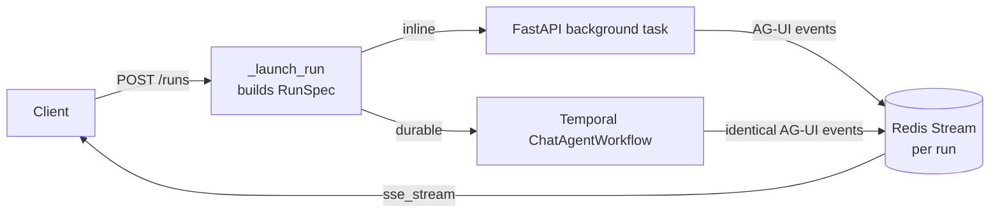

# Architecture

Personal Agent (Python package `personal_agent`) is a multi-tenant, self-hostable
**LLM chat + agent platform**. The stack is FastAPI + pydantic-ai (v1.x), Temporal
(self-hosted, durable agent runs), Quasar/Vue 3 frontend, Keycloak/OIDC,
Postgres+pgvector, Redis, Kubernetes/Compose.

## Services at a glance

| Service | Role |
| --- | --- |
| **backend** (`services/api/`) | FastAPI server + pydantic-ai runtime; Temporal client; AG-UI over Redis Streams → SSE, WebSocket control. |
| **worker** (`services/worker/`) | Temporal worker: durable runs, the per-chat memory **Curator**, scheduled maintenance. |
| **frontend** (`apps/web/`) | Quasar (Vue 3) SPA + PWA. |
| **keycloak** (`deploy/keycloak/`) | OIDC auth, realm-as-code. |
| **Postgres + pgvector** | Primary store + vector search. |
| **Redis** | AG-UI token stream, control/presence pub/sub, rate limits. |
| **Temporal** | Durable engine for runs, the Curator, and schedules. |
| **device-agent** (`clients/device-agent/`) | Cross-platform Rust agent (jailed FS + PTY). |
| **browser-sandbox** / **browser-extension** | Playwright cloud browser / Chrome MV3 extension — both `browser` devices. |

Shared **contracts** (identity, run spec, bus, control, usage, world memory,
errors, keys) live in `packages/personal-agent-contracts/`.

## Two run paths, one envelope

A chat turn runs either **inline** (a FastAPI background task,
`realtime/producers/inline.py`) or **durable** (a Temporal `ChatAgentWorkflow` in
`services/worker/`). `api/routers/runs.py` (`_launch_run`) is the shared chokepoint
that decides INLINE vs DURABLE and builds the `RunSpec`. Both paths emit **identical**
AG-UI events onto a per-run Redis Stream, which `sse_stream` relays to the client.



## Model resolution + governance

Lives across `agent/model_pipeline.py`, `agent/auto_model.py`, `agent/governance.py`
and `agent/resolver.py`:

- `cfg["model"] == "auto"` → `pick_auto_model` (tag-ranked among
  governance-compatible enabled models).
- An explicit `provider:model` → `resolver.build_byok` with the admin platform key.
- `enforce_classification(...)` is the **single** fail-closed gate, applied inline,
  in the durable router and in automations/comms.
- The fallback chain is a `FallbackModel` built from `ranked_compatible_labels`,
  preferring **provider-diverse** fallbacks.

## Toolset assembly + tag gating

`ToolsetAssembler.assemble()` snapshots the run's tools at run start. After the
model resolves, its `provider_tags` drive a BLOCK-mode tag gate over integrations /
MCP / first-party tools, plus the untrusted-content high-privilege gate. Ambient
**capability providers** (`web_search` / `web_fetch` / `weather`) are resolved from
**all** the user's enabled integrations, independent of the per-chat integration
toolset selection.

## Sub-agents

`explore` (read-only) / `delegate` (inherits tools) / `run_agents_script` spawn
nested pydantic-ai runs, each with its **own** `run_id` + `Run` row
(`runs.parent_run_id`) and independent usage. A worker is gated by **its** model's
provider tags, not the parent's.

## Repository layout

```text
packages/personal-agent-contracts/  shared cross-slice contracts
services/api/                       FastAPI server + pydantic-ai runtime
services/worker/                    Temporal worker (durable runs + Curator)
apps/web/                           Quasar SPA + PWA
integrations/                       integrations (folder tier)
clients/device-agent/               Rust device agent (Linux/macOS/Windows)
clients/browser-sandbox/            Playwright cloud browser device
clients/browser-extension/          Chrome MV3 extension (browser device)
deploy/keycloak/                    realm-as-code
deploy/                             Dockerfiles, Compose, Helm
docs/                               design notes & plans
```

The design's invariants are captured as [Frozen contracts](frozen-contracts.md) —
the seams where slices otherwise drift.
