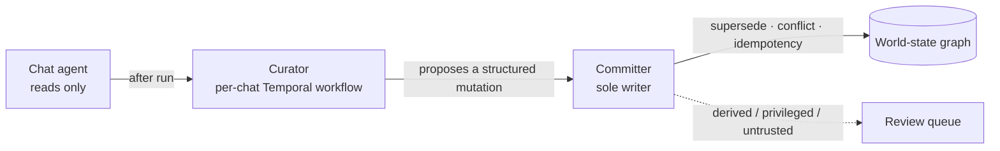

# Memory — the world-state graph

The agent's long-term memory is a **bitemporal, causal entity-state graph**, not a
flat note store. Knowledge is **entities** (`person`, `task`, `preference`, … — an
open, integration-extensible kind registry) linked by **facts**
(subject–predicate–object; a fact pointing at another entity is a relationship).

## Two time axes

Every fact carries **valid-time** (true in the world) and **system-time** (when the
agent learned it), so it can answer:

- *"What was true on Monday?"* (valid-time) versus
- *"What did you **know** on Monday?"* (system-time)

…and explain late knowledge and corrections.

## Causality & provenance

Facts record their source and the run/action that caused them — so you can trace
the effects of a run and explain any change.

## Read / propose / write split

The memory pipeline keeps writers deterministic and the chat agent read-only:

- The chat agent only **reads**.
- A post-run **Curator** (a per-chat Temporal workflow) proposes a structured
  mutation.
- A deterministic **Committer** is the sole writer — handling supersede, conflict,
  idempotency and autonomy routing (explicit/observed auto-commit;
  derived/privileged/untrusted go to review).

## Forgetting = invalidating

Corrections **supersede / invalidate** rather than delete, so history and as-of
queries survive. Conflicts and merge suggestions surface conversationally in the
main chat.

## Strictly private

Owner-scoped with fail-closed RLS; untrusted content also drops privileged writes.

## Entities and memory are one concept

Integration entities (the live-state layer) feed the graph: an entity type can
declare a `world_kind`, and the sync engine then maintains a linked graph node per
entity — renamed on sync, **archived (never deleted)** when the integration drops
it, so attached facts survive.

- The knowledge page is **one list** (graph nodes with live-state badges plus
  live-only entities).
- Kinds carry a **physical vs. virtual** nature axis, and `contact` is the single
  kind for humans.
- A **graph UI** shows entity pages plus a neighbourhood + causal-trace graph that
  live-updates as facts commit.

!!! note "Full design"
    The complete design lives in [Universal memory](../universal-memory.md).
