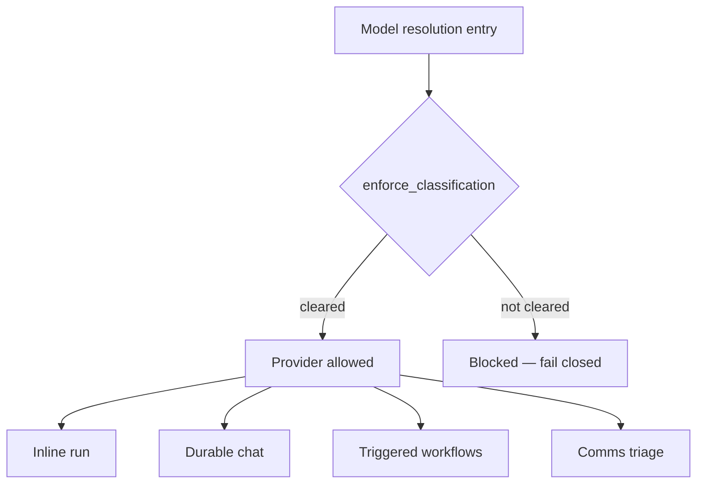

# Security & governance

Security is woven through every run path, not bolted on. The same gates re-apply
inside durable runs, the model fallback chain, `auto` model selection and
sub-agent `model_tags` resolution — there is **no path to an uncleared provider**.

## Per-chat security modes

Each chat runs in one of three tool-call security modes:

| Mode | Behaviour |
| --- | --- |
| `autonomous` | The agent calls tools without per-call approval |
| `approve_each` | Each tool call waits for explicit user approval |
| `judge` | An LLM judge gates each call |

## Untrusted-content gating

When an untrusted source is in a run, high-privilege tools (and custom-agent
delegation) are **filtered out**. The assembler drops high-privilege first-party /
device tools via `toolset.filtered()`; the durable worker mirrors this per-request.

## Safe parallelism

Read tools run concurrently while device writes are
**serialized** to avoid races on the shared jail.

## BYOK envelope encryption

Provider keys and secrets are envelope-encrypted — decrypted only in the model
activity, **never** serialized into Temporal history, spans or errors.

!!! warning "No secrets in spans"
    Content capture defaults **off**; provider keys never appear in `ModelSettings`
    dumps, errors or Temporal inputs.

## Tenancy

The org header is validated against the token claim **every request**, with
Postgres **RLS** as defense-in-depth (`ScopedDbDep` sets `personal_agent.current_org`).

## ABAC governance & data classification

Providers carry capability tags (`local`, `eu`, `no-train`, …); tools, integrations
and MCP servers declare required tags, and a capability is offered only when
**required ⊆ granted** (fail-closed).

- Chat / document / entity **data classification** gates RAG and provider choice.
- Org policy sets a **floor**.
- Gated capabilities are **explained to the agent**, and governance changes are
  audit-logged.

The single fail-closed gate (`auto_model.enforce_classification`) runs at every
model-resolution entry. See [Frozen contracts](../architecture/frozen-contracts.md)
(#13, #14, #15).
